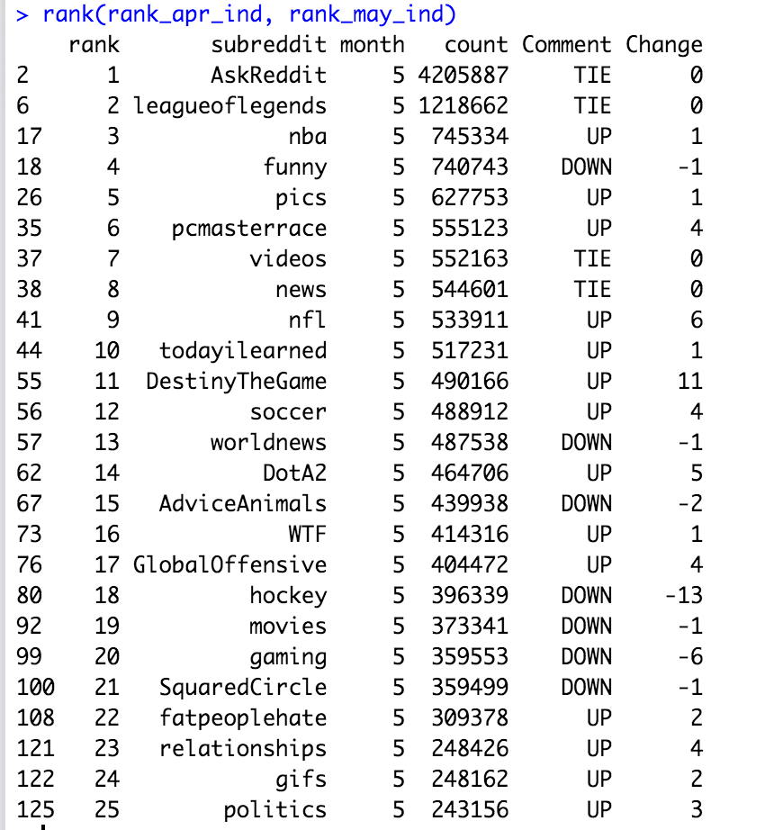
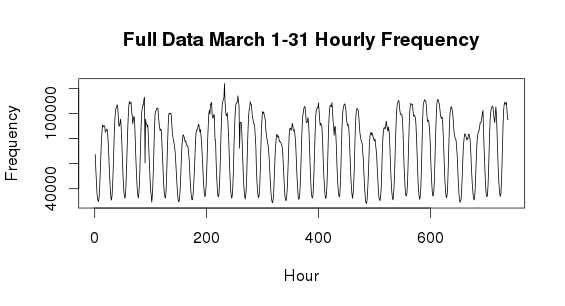
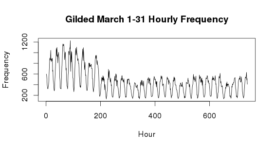
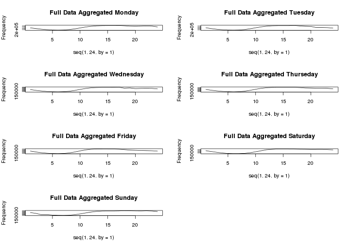
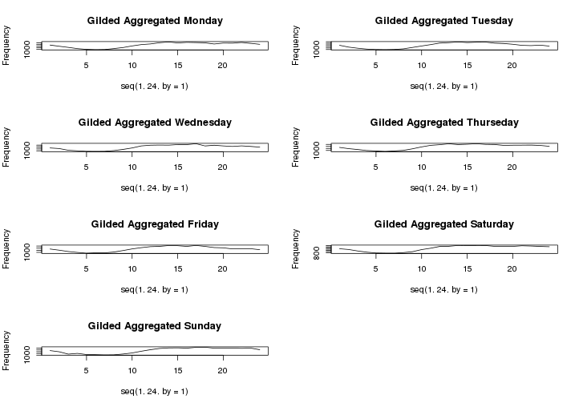
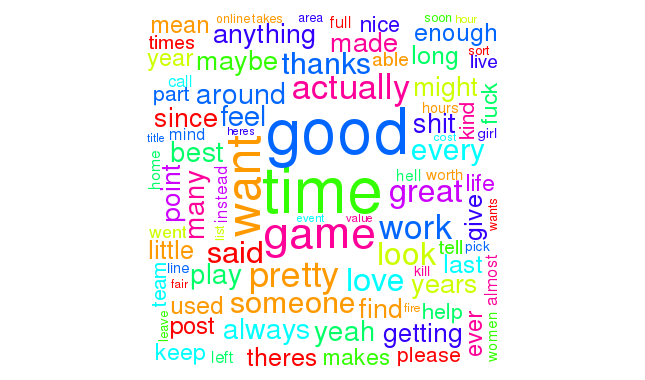

### Task 0 - List of Files in Homework 5

Below are the required files for the homework 5:

+ **SparkR_Task1.R**: this is the R script for the first task;
+ **SparkR_Task2.R**: this is the R script for the second task;
+ **Mapreduce_task3.R**: this is the R script for the third task;
+ **hw5.Rmd**: the write up for this homework 
+ **hw5.html**: the output of markdown file;
+ **Makefile**
+ **Other Files**: the png file and Rdata files are to support the write up.

**HINT:** Before running each task, please clean the environment, terminate R and restart R.


### Task 1 - What’s popular with Redditors?

The purpuse of the task 1 is to generate a Billboard-like table of the the 25 most popular subreddits for every month from the January to the May. In addition, the task will mark the changes for each of the 25 subreddits compared to the previous month. This task is majorly carried in SparkR. 

The original data is provided in the jason file. The json file contains the information for every subreddit as an "information block". The "information block" example of the jason file looks like below. It has the detailed items for the specific subreddit, such as gilded, parent_id, text body, creation time and so on.

```json
{"gilded":0,
  "author_flair_text":"Male",
  "author_flair_css_class":"male",
  "retrieved_on":1425124228,"ups":3,
  "subreddit_id":"t5_2s30g",
  "edited":false,
  "controversiality":0,
  "parent_id":"t1_cnapn0k",
  "subreddit":"AskMen",
  "body":"I can't agree with passing the blame, but I'm glad to hear it's at least helping you with the anxiety. I went the other direction and started taking resp onsibility for everything. I had to realize that people make mistakes including myself and it's gonna be alright. I don't have to be shackled to my mistakes and I don't have to be afraid of making them.",
  "created_utc":"1420070668",
  "downs":0,
  "score":3,
  "author":"TheDukeofEtown",
  "archived":false,
  "distinguished":null,
  "id":"cnasd6x",
  "score_hidden":false,
  "name":"t1_cnasd6x",
  "link_id":"t3_2qyhmp"
}
```

**jsonFile** is the specific function in SparkR to read the jason file from the HDFS. This will convert the jason file into a DataFrame like structure, j_all_five, on the cloud. Each column of j_all_five stores the key of the jason file. 

```{r, eval=FALSE}
j_all_five = jsonFile(sqlContext, "hdfs://localhost:9000/data/RC_2015-0*.json")
```

Each comment belongs to a particular subreddit, we would like to know for the given time period what were the 25 most popular subreddits? We would also like to have this broken down by month (Jan to May) - create a Billboard-like table for each month that shows the top 25 subreddits for that month that also includes the change in rank since the previous month. Comment on any subreddits that show a strong positive or negative trend.

**registerTempTable** will register this DataFrame, `j_all_five`, as a table, `j_all_five`:

```{r, eval=FALSE}
registerTempTable(j_all_five, "reddit_all_five")
```

Then SQL function `sql` will be used to extract the column **subreddit** and the column **created_utc**.

```{r, eval=FALSE}
res_all_five = sql(sqlContext, "SELECT subreddit, created_utc FROM reddit_all_five")
```

The unix time **created_utc** can be converted to the normal time format by function `from_unixtime`, this can be saved as a new column **time**. The month of the creation time for each subreddit can be extracted by `month` from the column **time**. The month will be saved as another new column **month**.

```{r, eval=FALSE}
res_all_five$time=from_unixtime(res_all_five$created_utc, format = "yyyy-MM-dd HH:mm:ss")
res_all_five$month=month(res_all_five$time)
```

`group_by` will group the data frame **res_all_five** in terms of the creation month and the subreddit name. This will return the frequncy of each subreddit occurring for every month. `arrange` will rank the subreddit from the most popular to the least popular in terms of the frequncy. 

```{r, eval=FALSE}
res_all_five=count(group_by(res_all_five,"subreddit","month"))
res_all_five=arrange(res_all_five, desc(res_all_five$count))
res_all_five_collected = collect(res_all_five)
```

After collect the data frame into our local file, we can create a Billboard-like table for each month that shows the top 25 subreddits for that month. First, created five DataFrames for each month with the order of the populority 

```{r, eval=FALSE}
rank_jan = res_all_five_collected[res_all_five_collected$month == 1,]
rank_feb = res_all_five_collected[res_all_five_collected$month == 2,]
rank_mar = res_all_five_collected[res_all_five_collected$month == 3,]
rank_apr = res_all_five_collected[res_all_five_collected$month == 4,]
rank_may = res_all_five_collected[res_all_five_collected$month == 5,]
```

Add the rank index as a new column to each of the month, this is convenient for us to compare the difference between the two month.

```{r, eval=FALSE}
# add the rank index number as column to each of the 5 month
rank_jan_ind = cbind("rank" = seq(1,dim(rank_jan)[1], by = 1), rank_jan)
rank_feb_ind = cbind("rank" = seq(1,dim(rank_feb)[1], by = 1), rank_feb)
rank_mar_ind = cbind("rank" = seq(1,dim(rank_mar)[1], by = 1), rank_mar)
rank_apr_ind = cbind("rank" = seq(1,dim(rank_apr)[1], by = 1), rank_apr)
rank_may_ind = cbind("rank" = seq(1,dim(rank_may)[1], by = 1), rank_may)
```

A function, **rank**, is created to construct a BillBoard like ranking. The funcation will take two DataFrames, df1 and df2. df1 can be treated as the previous month. df2 can be treated as the current month. df2 will be compared with df1.The function will return the df2 with two new columns. The first column is called **Comment**: 

+ Any item that being ranked down from df1 to df2 will be marked as "DOWN"; 
+ Any item that being ranked up from df1 to df2 will be marked as "UP"; 
+ Any item that being ranked the same from df1 to df2 will be marked as "TIE"; 
+ Any item that exist in df2 but does not exist in df1 will be marked as "NEW". 

Column 2 is called **Change**. This column will shows the rank chance from the current month to the previous month. Corresponding to the four status in **Comment**, **Change** also has 4 possibilities:

+ "DOWN": the rank that has been lowered from the previous month (df1);
+ "UP": the rank that has been improved from the previous month (df1);
+ "TIE": 0, because does not change;
+ "NEW": the current rank, because the reddit does not even appear in previous month, there is nothing to compare, so it just return the current rank.


```{r, eval=FALSE}
rank = function (df1, df2) {
#  df1 = rank_jan_ind
#  df2 = rank_feb_ind
  df1_new = df1
  df2_new = df2
  
  df1_new$subreddit = tolower(df1_new$subreddit)
  df2_new$subreddit = tolower(df2_new$subreddit)
  df_merge = merge(x = df2_new, y = df1_new, by = "subreddit", all.x = TRUE)
  df_merge = arrange(df_merge, rank.x) 
  
  df2$Comment = ""
  df2$Comment[which(df_merge$rank.x == df_merge$rank.y)] = "TIE"
  df2$Comment[which(df_merge$rank.x > df_merge$rank.y)] = "DOWN"
  df2$Comment[which(df_merge$rank.x < df_merge$rank.y)] = "UP"
  df2$Comment[is.na(df_merge$rank.y)] = "NEW"
  
  df2$Change = 0
  df2$Change[which(df_merge$rank.x == df_merge$rank.y)] = 0
  df2$Change[which(df_merge$rank.x > df_merge$rank.y)] = abs(df_merge$rank.x[which(df_merge$rank.x > df_merge$rank.y)] - df_merge$rank.y[which(df_merge$rank.x > df_merge$rank.y)])*(-1)
  df2$Change[which(df_merge$rank.x < df_merge$rank.y)] = abs(df_merge$rank.x[which(df_merge$rank.x < df_merge$rank.y)] - df_merge$rank.y[which(df_merge$rank.x < df_merge$rank.y)])
  df2$Change[is.na(df_merge$rank.y)] = df_merge$rank.x[is.na(df_merge$rank.y)]
  
  return (df2[1:25,])
}
```


This is the output for the May top 25 compared to the April list.



##Task2 -  When do Redditors post?

We choose **March** data for this analysis. The purpose of this homeowrk is to visualize:

+ The monthly reddit posts trend from the first hour of the month to the last hour of the month;
+ The aggregated weekly reddit posts trend from the first hour of the weekday to the last hour of the weekday; As there are 7 days in each weekday, so there are seven plots;
+ The monthly **gilded** reddit posts trend from the first hour of the month to the last hour of the month;
+ The aggregated weekly **gilded** reddit posts trend from the first hour of the weekday to the last hour of the weekday; As there are 7 days in each weekday, so there are seven plots;

Different from the task one, we do not need the specific name of the reddit, we only need the count of reddit posts happening in the specific time, specified down to second. 

First, we need collect the data from SparkR. We are doing two collects. The first collect is for the entire March reddit posts, we collect the data grouped by time, `res_long_all`. This groups the reddit posts happening in the specific timestamp (second) and returns the count of posts at that time stamp as a new column.

```{r, eval=FALSE}
res_long_group=count(group_by(reddit, "time"))
res_long_all = SparkR::collect(res_long_group)
```

The second collect is for the gilded reddit posts in March, we also collect the data grouped by time, `res_short`. The count for reddit posts at specific time stamp is also handled as `res_long_all`.

```{r, eval=FALSE}
res_short_group = count(group_by(reddit[reddit$gilded==1,], "time"))
res_short = SparkR::collect(res_short_group)
```

Second, we have collect the data from the SparkR to the data frame. we need stract the date, hour and month information for `res_long_all`. We convert the formate of the time as as.POSIXlt. Then we can use `mon`, `hour`, `mday` to extract the corresponding month, hout and date information. `res_short` is also handled in the similar way.

```{r, eval=FALSE}
# March data's month is coded as 2 instead of 1
res_long_all = res_long_all[which(as.POSIXlt(res_long_all$time)$mon == 2),]
res_long_all$month = as.POSIXlt(res_long_all$time)$mon + 1
res_long_all$hour = as.POSIXlt(res_long_all$time)$hour
res_long_all$date = as.POSIXlt(res_long_all$time)$mday
```

`res_short` is also handled similarly:

```{r, eval=FALSE}
res_short = res_long_all[which(as.POSIXlt(res_short$time)$mon == 2),]
res_short$month = as.POSIXlt(res_short$time)$mon + 1
res_short$hour = as.POSIXlt(res_short$time)$hour
res_short$date = as.POSIXlt(res_short$time)$mday
```

Third, we need aggregate the total count for reddits at each hour in March. This basically is the sum of the count at each second within that hour, and return the total count for each hour from the first hour in March to the last hour in March. 

```{r, eval=FALSE}
library(dplyr)
byMon <- group_by(res_long_all, hour, date)
sumMon_res_long_all <- summarize(byMon, totalCount = sum(count)) 
```

The gilded reddits hourly count is also handled in the similar way:

```{r, eval=FALSE}
library(dplyr)
byMon_res_short <- group_by(res_short, hour, date)
sumMon_res_short <- summarize(byMon_res_short, totalCount = sum(count))
```

Forth, we can plot the hourly trend in March for both the full data (the first plot) and gilded data (the second plot). 

We can see that the hourly trend for the full data has up and down pattern, this is due to that the more posts during the day time but less during the night time. The second plot shows that the gilded data posts gradually decrease from the starting of the month to the end of the month. The gilded posts starting decreasing from around the 200th hour which is the 9th day. 


```{r, eval=FALSE}
mixgrid_plot1 = sumMon_res_long_all[order(sumMon_res_long_all$date, sumMon_res_long_all$hour),]
dim(mixgrid_plot1)
par(mfrow=c(1,1))
plot(x=seq(1, dim(mixgrid_plot1)[1], by = 1), y = mixgrid_plot1$totalCount, type = "l", 
     xlab = "Hour", ylab = "Frequency", main = "Full Data March 1-31 Hourly Frequency")
```



```{r, eval=FALSE}
hour_month_plot_gild = sumMon_res_short[order(sumMon_res_short$date, sumMon_res_short$hour),]
dim(hour_month_plot_gild) # 669    3
par(mfrow=c(1,1))
plot(x=seq(1, dim(hour_month_plot_gild)[1], by = 1), y = hour_month_plot_gild$totalCount, type = "l", 
     xlab = "Hour", ylab = "Frequency", main = "Gilded March 1-31 Hourly Frequency")
```



In the last, we can plot the aggregated hourly weekday posts for full data and gilded reddits. Both the plot shows that the trend increases during the day time and decreases during the night time. But there is no obviouse difference between the trend:

Here is how is plotted for the full data:

```{r, eval=FALSE}
res_long_all$weekday=weekdays(as.POSIXlt(res_long_all$time))
test<- group_by(res_long_all, hour, weekday)
testsum <- summarize(test,countWeekday=sum(count))

# Rule the order of the weekday names
testsum$weekday <- factor(testsum$weekday, levels= c("Monday","Tuesday", 
                                                     "Wednesday", "Thursday", "Friday", "Saturday", "Sunday"))
testsum_new = testsum[order(testsum$weekday, testsum$hour),]
testsum_new$mark = paste(testsum_new$weekday, " Hour: ",testsum_new$hour, sep = "")

par(mfrow=c(4,2))
plot(seq(1, 24, by = 1), testsum_new$countWeekday[1:24], type = "l", main = "Full Data Aggregated Monday", ylab = "Frequency")
plot(seq(1, 24, by = 1), testsum_new$countWeekday[25:48], type = "l", main = "Full Data Aggregated Tuesday", ylab = "Frequency")
plot(seq(1, 24, by = 1), testsum_new$countWeekday[49:72], type = "l", main = "Full Data Aggregated Wednesday", ylab = "Frequency")
plot(seq(1, 24, by = 1), testsum_new$countWeekday[73:96], type = "l", main = "Full Data Aggregated Thurseday", ylab = "Frequency")
plot(seq(1, 24, by = 1), testsum_new$countWeekday[97:120], type = "l", main = "Full Data Aggregated Friday", ylab = "Frequency")
plot(seq(1, 24, by = 1), testsum_new$countWeekday[121:144], type = "l", main = "Full Data Aggregated Saturday", ylab = "Frequency")
plot(seq(1, 24, by = 1), testsum_new$countWeekday[145:168], type = "l", main = "Full Data Aggregated Sunday", ylab = "Frequency")

```


Here is how is plotted for the filded data:

```{r, eval=FALSE}
res_short$weekday=weekdays(as.POSIXlt(res_short$time))
test_1<- group_by(res_short,hour,weekday)
testsum_1 <- summarize(test_1, countWeekday=sum(count))

# Rule the order of the weekday names
testsum_1$weekday <- factor(testsum_1$weekday, levels= c("Monday","Tuesday", 
                                                         "Wednesday", "Thursday", "Friday", "Saturday", "Sunday"))
testsum_new_1 = testsum_1[order(testsum_1$weekday, testsum_1$hour),]
testsum_new_1$mark = paste(testsum_new_1$weekday, " Hour: ",testsum_new_1$hour, sep = "")

par(mfrow=c(4,2))
plot(seq(1, 24, by = 1), testsum_new_1$countWeekday[1:24], type = "l", main = "Gilded Aggregated Monday", ylab = "Frequency")
plot(seq(1, 24, by = 1), testsum_new_1$countWeekday[25:48], type = "l", main = "Gilded Aggregated Tuesday", ylab = "Frequency")
plot(seq(1, 24, by = 1), testsum_new_1$countWeekday[49:72], type = "l", main = "Gilded Aggregated Wednesday", ylab = "Frequency")
plot(seq(1, 24, by = 1), testsum_new_1$countWeekday[73:96], type = "l", main = "Gilded Aggregated Thurseday", ylab = "Frequency")
plot(seq(1, 24, by = 1), testsum_new_1$countWeekday[97:120], type = "l", main = "Gilded Aggregated Friday", ylab = "Frequency")
plot(seq(1, 24, by = 1), testsum_new_1$countWeekday[121:144], type = "l", main = "Gilded Aggregated Saturday", ylab = "Frequency")
plot(seq(1, 24, by = 1), testsum_new_1$countWeekday[145:168], type = "l", main = "Gilded Aggregated Sunday", ylab = "Frequency")

```


##Task 3 - What do people say on Valentine's Day?

In the part, we are ask the compare the frequently used words in Valentine's Day to two other dates. The approach we take in the task are as below:

+ Step 1: Use Rhipe on Saxon to pull down needed information, such as "body" and "date" in the JSON file. Things to be noted, the time in reddit's JSON file are stored as UNIX time, thus we need "as.POSIXct" to change the UNIX time to the "usual" time, and we filter the information on 3 specific date. We chose "2015-02-02" and "2015-02-27" as bases for comparison with "2015-02-14".

```{r,eval=FALSE}
user_reduce = expression(
  pre = {
    total = 0
  },
  reduce = {
    total = total + sum(unlist(reduce.values))
  },
  post = {
    rhcollect(reduce.key, total)
  }
)

user_map2 = expression({
  suppressMessages(library(jsonlite))
  lapply(
    seq_along(map.keys), 
    function(r) 
    {
      day=as.Date(as.POSIXct(as.numeric(fromJSON(map.values[[r]])$created_utc),
                             origin="1970-01-01",gtz="GMT"))
      if (day=="2015-02-14" | day=="2015-02-27" | day=="2015-02-02") {
        key = list(time=day,comment=fromJSON(map.values[[r]])$body)
        value = 1
        rhcollect(key, value)
      }
      
    }
  )
})

user2 = rhwatch(
  map      = user_map2,
  reduce   = user_reduce,
  input    = rhfmt("/data/RC_2015-02.json", type = "text")
)

```

+ Step 2: Text Combining and Seperating. In this step, we initialize 3 functions to get the value: "Time", "Comment" and "Value" we needed in the list. And then combine them as a dataframe. The dataframe which is comprehensive of all three days are then separated into 3 different dataframe with unique date. 

```{r,eval=FALSE}
get_time = function(x,i) as.character(x[[i]]$time)
get_comment=function(x,i) as.character(x[[i]]$comment)
get_val=function(x,i) x[[i]]
#Combine the values in the list to a dataframe
counts = data.frame(key = sapply(user2,get_time,i=1),comment = sapply(user2,get_comment,i=1), 
                    value=sapply(user2,get_val,i=2), stringsAsFactors=FALSE)
 
#Seperate 3 individual dataset for respective date
counts_0202=counts[which(counts$key=="2015-02-02"),]
counts_0214=counts[which(counts$key=="2015-02-14"),]
counts_0227=counts[which(counts$key=="2015-02-27"),]
```


+ Step 3: Text Cleaning. In this step, we want our comment to be as clean as possible, meaning that we need to clean some irregular expressions in the comment. We formulated a function to clean the comments in a dataframe. This function mainly serves the purpose of removing digits, irregular graph expression, punctuations, etc. We apply this function then to the "comment" column in these 3 independent dataset. For frequence calculation, we use the base R function "table" for word frequency. 

Thus, after applying "word_count_map_no_short" to the comment column, we have 3 new dataset storing the frequency of the words.

```{r,eval=FALSE}
library(magrittr)
library(stringr)

word_count_map_no_short = function(x)
{
  x=gsub("[[:digit:]]", "", x)
  x = gsub("[ \t]{2,}", " ", x)
  x = gsub("^\\s+|\\s+$", "", x)
  x %>% tolower() %>%
    str_replace_all("[[:punct:]]","") %>%
    str_split(" ") %>% 
    unlist() %>% 
    str_trim() %>%
    .[. != ""] %>%
    .[nchar(.) > 3] %>%
    base::table() 
}

freq_0214= word_count_map_no_short(counts_0214$comment)
freq_0202= word_count_map_no_short(counts_0202$comment)
freq_0227= word_count_map_no_short(counts_0227$comment)

```


+ Step 4: In this step, we further transform the word frequency table we obtain from the previous step, and removing meaningless words (stopewords) from the word frequency dateframe.

We have use the function "stopwords('en')" to give us the most frequently used words with actually employ no concrete information, we also specify other words which is also not meaningful for us to access the information people trying to convey from their comments.

```{r,eval=FALSE}
library(tm)

stopwords=c(stopwords("en"),"just", "dont","thats","didnt","doesnt","thats","like",
            "people","will","think","really","also","even","cant","still","youre",
            "know","much","something","make","going","something","right",
            "well","take","thing","though","first","need","back","sure","better","never"
            ,"things","probably","isnt")
```

After obtaining stopwords, we transform the data struction and remove the stopwords from the dataframe, which is achieved by the commands below.

```{r, eval=FALSE}
#Valentines Day Word Count
valentine_freq=as.matrix(sort(freq_0214,decreasing = T))
valentine_freq_df=data.frame(valentine_freq)
valentine_freq_df$words=row.names(valentine_freq_df)
##Remove meaningless frequent words
valentine_freq_df=valentine_freq_df[-which(valentine_freq_df$words %in% stopwords),]

#Before Valentines Day Word Count
valentine_freq_02=as.matrix(sort(freq_0202,decreasing = T))
valentine_freq_df_02=data.frame(valentine_freq_02)
valentine_freq_df_02$words=row.names(valentine_freq_df_02)
##Remove meaningless frequent words
valentine_freq_df_02=valentine_freq_df_02[-which(valentine_freq_df_02$words %in% stopwords),]

#After Valentine's Day Word Count
valentine_freq_27=as.matrix(sort(freq_0227,decreasing = T))
valentine_freq_df_27=data.frame(valentine_freq_27)
valentine_freq_df_27$words=row.names(valentine_freq_df_27)
##Remove meaningless frequent words
valentine_freq_df_27=valentine_freq_df_27[-which(valentine_freq_df_27$words %in% stopwords),]

```

Then, we use "wordcloud" package to create a visualization of frequent words in 3 different data, "2014-02-14","2015-02-02"(before Valentine's Day) and "2015-02-27"(after Valentine's Day). 

```{r,eval=FALSE}
#Visulization of Word Frequency by Word Cloud
wordcloud(words = valentine_freq_df$words,random.color = TRUE, colors=rainbow(10), 
          freq = valentine_freq_df$valentine_freq, min.freq = 5000, random.order = F)
wordcloud(words = valentine_freq_df_02$words,random.color = TRUE, colors=rainbow(10), 
          freq = valentine_freq_df_02$valentine_freq_02, min.freq = 5000, random.order = F)
wordcloud(words = valentine_freq_df_27$words,random.color = TRUE, colors=rainbow(10), 
          freq = valentine_freq_df_27$valentine_freq_27, min.freq = 5000, random.order = F)
```

####Analysis of what people said on Valentines' Day, before Valentine's Day and after Valentines' Day.
From the wordcloud in below, I don't think there exist a disparate divergence on what people said on these 3 days.




